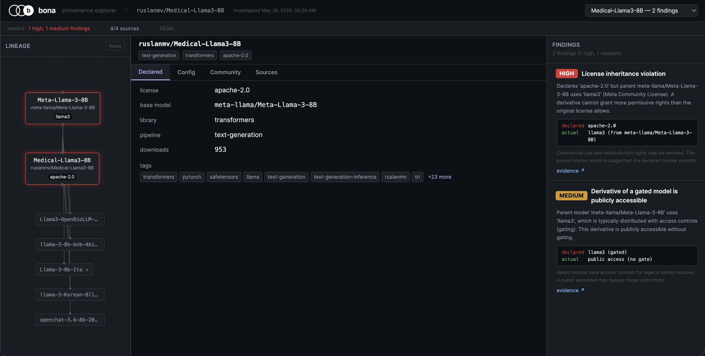

# Yurai

**yurai** — 由来, *"origin; where a thing comes from."*

Yurai is a provenance auditor for AI models. It traces model lineage, audits license inheritance, and flags trust gaps across Hugging Face models.

Run it from the CLI, wire it into CI, or explore findings in an investigation UI.

> Know what you're depending on.



**[Live demo](https://gavxm.github.io/yurai)** · **[Install](#install)**

## Findings

- **License inheritance violations**: Apache-2.0 declared on a Llama
  derivative that's actually governed by Meta's Community License
- **Transitive license violations**: permissive license on a model whose
  grandparent or earlier ancestor uses a copyleft or restricted license
- **Lineage inconsistencies**: declared base model doesn't match the
  architecture in config.json
- **Gated-derivative detection**: public models derived from gated parents,
  bypassing access controls (uses the direct HF `gated` field, falls back
  to license heuristics)
- **Documentation gaps**: missing license or base model declarations
- **Trust signals**: new uploader accounts, zero community engagement, high
  downloads with zero likes, recently modified old models
- **Metadata anomalies**: weight sizes that don't match the declared
  architecture, undeclared quantization, suspicious or missing weight files

Each finding includes a severity, a reason explaining *why* it matters, and
the raw declared-vs-actual values that triggered it.

## Install

```sh
cargo install yurai
```

## Usage

```sh
# Investigate a model
yurai investigate meta-llama/Llama-3.1-8B-Instruct

# JSON output
yurai investigate ruslanmv/Medical-Llama3-8B --json

# SARIF output (for GitHub code scanning)
yurai investigate ruslanmv/Medical-Llama3-8B --sarif

# Fail CI on high-severity findings
yurai investigate some/model --fail-on-high
```

Batch mode - investigate multiple models from a file or stdin:

```sh
# From a file
yurai batch --from models.txt

# From stdin
echo -e "microsoft/phi-2\nruslanmv/Medical-Llama3-8B" | yurai batch

# Batch with SARIF output
yurai batch --from models.txt --sarif results.sarif
```

Set `HF_TOKEN` to access gated models:

```sh
export HF_TOKEN=hf_...
yurai investigate meta-llama/Llama-3.1-8B-Instruct
```

## Web Explorer

Three-panel investigation UI: lineage graph, tabbed evidence details, and
findings with declared-vs-actual diffs. Click a finding to highlight the
related evidence across all panels.

**[gavxm.github.io/yurai](https://gavxm.github.io/yurai)**

Run locally:

```sh
cd web && npm install && npm run dev
```

## GitHub Action

Add provenance checks to your CI pipeline:

```yaml
- uses: gavxm/yurai@v0.3.0
  with:
    models: |
      meta-llama/Llama-3.1-8B-Instruct
      ruslanmv/Medical-Llama3-8B
    fail-on-high: true
    hf-token: ${{ secrets.HF_TOKEN }}
```

The Action investigates each model and posts a summary to the job output.
Set `fail-on-high: true` to block merges when HIGH severity findings exist.

## How It Works

Yurai fetches evidence from four HuggingFace sources concurrently, then runs
cross-referenced checks across them:

| Source                    | What it provides                                                                     |
| ------------------------- | ------------------------------------------------------------------------------------ |
| HF metadata               | license, base model, tags, downloads, likes, gated status, file listing, timestamps |
| Model tree                | multi-hop lineage chain (up to 4 ancestors), licenses, gated status, siblings        |
| config.json + safetensors | architecture, parameters, weight size, quantization config                           |
| Community signals         | uploader account age, discussion activity                                            |

The key insight is **gap-as-signal**: contradictions between sources are the
findings, not incidental noise.

## Architecture

```text
src/lib.rs       :types, public API, schema
src/engine.rs    :investigation orchestration
src/main.rs      :CLI, batch mode, SARIF output
src/render.rs    :terminal text rendering
src/sources/     :evidence fetchers (HF metadata, model tree, config, community)
src/findings/    :cross-referenced checks (license, lineage, gated, trust, metadata, doc gaps)
web/             :React + Vite + Tailwind
```

## License

AGPL-3.0. See [LICENSE](./LICENSE).
